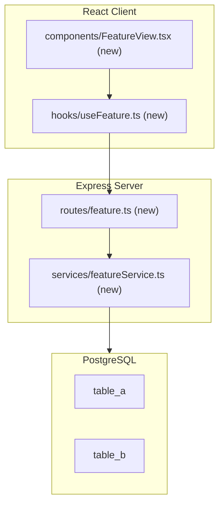
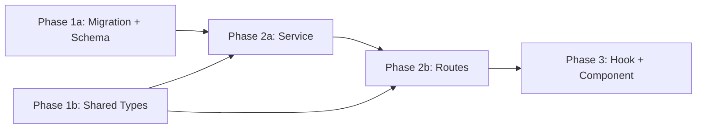

# Design Doc Template

Copy this file to `design-docs/<kebab-case-feature-name>.md` and fill in every section. Delete placeholder text and any sections that genuinely do not apply (e.g. "Database Schema" for a client-only change). Do not leave placeholder text in the committed file.

---

```markdown
---
name: <Feature Name>
overview: <1-2 sentence summary of what this feature does and why it is being built.>
todos:
  - id: phase-1a-<short-task-name>
    content: "Phase 1a: <Description of deliverable — be specific about files and functions>"
    status: pending
  - id: phase-1b-<short-task-name>
    content: "Phase 1b: <Description — tasks within a phase run in parallel>"
    status: pending
  - id: phase-2a-<short-task-name>
    content: "Phase 2a: <Description — depends on all Phase 1 tasks completing>"
    status: pending
isProject: false
---

# <Feature Name>

## Current State

Describe what exists today. Be concrete — name the files, services, or behaviors that are insufficient or missing. This section answers "why is this change needed now?"

## Architecture



## Database Schema

> Omit this section if no DB changes are required.

Create a single migration: `npm run migrate:create -- <migration-name>`

**`table_name`**
- `id` UUID PK DEFAULT gen_random_uuid()
- `user_id` TEXT NOT NULL — Azure AD OID
- `field_one` TEXT NOT NULL
- `field_two` JSONB — typed as `YourType` in schema.ts
- `created_at` TIMESTAMPTZ NOT NULL DEFAULT now()
- INDEX on `(user_id, created_at DESC)`

After creating the migration, update `src/server/db/schema.ts` with matching `pgTable` definitions and `relations()`.

## Server Changes

### Service: `src/server/services/featureService.ts` (new)

Follow patterns from `src/server/services/chatThreadRepository.ts` (Drizzle queries, typed returns).

- `functionOne(param: string): Promise<ReturnType>` — describe what it does
- `functionTwo(id: string, data: InputType): Promise<void>` — describe what it does

### Middleware (if applicable)

If the feature requires new middleware, describe it here. Otherwise omit.

### Routes: `src/server/routes/feature.ts` (new)

Mount at `/api/feature` behind `ensureAuthenticated` in `src/server/index.ts`.

| Method | Path | Auth | Body / Params | Returns |
|--------|------|------|---------------|---------|
| `GET` | `/` | session | — | `FeatureItem[]` |
| `POST` | `/` | session | `{ field: string }` | `201` + created item |
| `DELETE` | `/:id` | session | — | `204` |

## Client Changes

### Hook: `src/client/hooks/useFeature.ts` (new)

```typescript
export function useFeatureList() {
  return useQuery<FeatureItem[]>({
    queryKey: ['feature-list'],
    queryFn: () => apiFetch('/api/feature'),
    staleTime: 30_000,
  });
}
```

### Component: `src/client/components/FeatureView.tsx` (new)

- Lazy-loaded from `App.tsx` at route `/feature`
- Uses `react-hook-form` + `zod` for any forms
- CSS Module: `FeatureView.module.css` (use CSS variables from `App.css`, never hardcoded values)

### `App.tsx` changes

- Add `'feature'` to `CurrentView` union
- Add `/feature` path matching
- Lazy-import `FeatureView` wrapped in `Suspense` + `ErrorBoundary`

## Key Design Decisions

- **Decision 1**: State the trade-off and the choice made. Example: "Dual-write to both JSON and Postgres during transition — this lets us roll back to file-only if Postgres has issues without losing data."
- **Decision 2**: Another trade-off. Example: "Pagination via limit/offset rather than cursor — simpler for the current scale; cursor pagination can be added later without a breaking API change."
- **Decision 3**: Add as many as needed.

## Phase Summary and Parallelization



**Multitask parallelism:**
- Phase 1 (1a + 1b) — both tasks have no dependencies; run in parallel
- Phase 2 (2a + 2b) — 2a (service) and 2b (routes) can start in parallel once Phase 1 is complete; 2b may need to import from 2a so coordinate on function signatures first
- Phase 3 — single task (depends on 2b)

## Files Changed / Created

| Action | Path |
|--------|------|
| Create | `migrations/<ts>_<migration-name>.sql` |
| Edit   | `src/server/db/schema.ts` |
| Create | `src/shared/types/feature.ts` |
| Create | `src/server/services/featureService.ts` |
| Create | `src/server/routes/feature.ts` |
| Edit   | `src/server/index.ts` |
| Create | `src/client/hooks/useFeature.ts` |
| Create | `src/client/components/FeatureView.tsx` |
| Create | `src/client/components/FeatureView.module.css` |
| Edit   | `src/client/App.tsx` |
```
