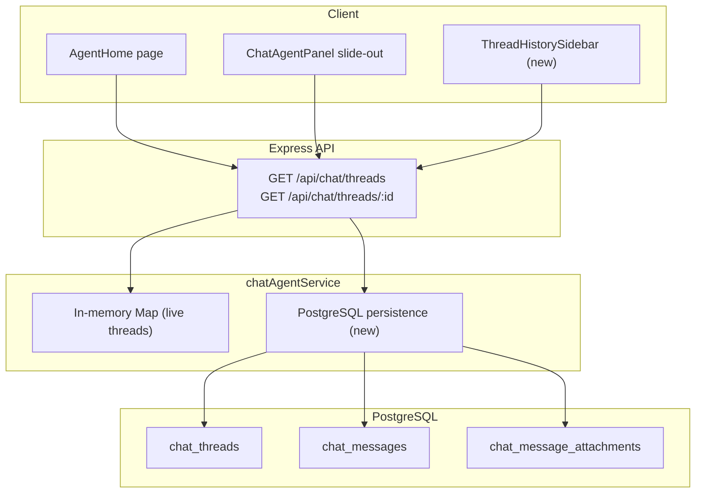

# Chat Thread History Persistence

## Current State

Threads are currently stored in two ephemeral layers:
- **In-memory** `Map<string, ThreadState>` in [`src/server/services/chatAgentService.ts`](../src/server/services/chatAgentService.ts) -- lost on server restart
- **JSON files** on disk under `<dataRoot>/chat-threads/<threadId>.json` -- survives restarts but not cloud deployments with ephemeral filesystems, and has no query capability

The user identity comes from Azure AD via `req.user` (OID or UPN), extracted with `getUserId()` in [`src/server/routes/chat.ts`](../src/server/routes/chat.ts).

Both entry points (`AgentHome` and `ChatAgentPanel`) create threads via `useStartChat()` / `POST /api/chat/threads` and view them via `useChatStream()`, but there is no UI to list or switch between past threads.

## Architecture



## Database Schema (3 tables, 1 migration)

Create a single migration file via `npm run migrate:local:create -- chat-thread-history`.

**`chat_threads`**
- `id` UUID PK
- `user_id` TEXT NOT NULL -- Azure AD OID
- `status` TEXT NOT NULL DEFAULT 'idle'
- `kickoff` JSONB NOT NULL -- stores the full `ChatThreadKickoff` object
- `cursor_agent_id` TEXT
- `workspace_dir` TEXT
- `last_error` TEXT
- `saved_wiki_url` TEXT
- `title` TEXT -- auto-generated summary (first user message, truncated to ~80 chars)
- `created_at` TIMESTAMPTZ NOT NULL DEFAULT now()
- `last_activity_at` TIMESTAMPTZ NOT NULL DEFAULT now()
- INDEX on `(user_id, last_activity_at DESC)`

**`chat_messages`**
- `id` UUID PK
- `thread_id` UUID NOT NULL REFERENCES chat_threads(id) ON DELETE CASCADE
- `role` TEXT NOT NULL -- 'user' | 'agent' | 'tool' | 'system'
- `text` TEXT NOT NULL
- `tool_name` TEXT
- `ts` TIMESTAMPTZ NOT NULL
- `created_at` TIMESTAMPTZ NOT NULL DEFAULT now()
- INDEX on `(thread_id, ts)`

**`chat_message_attachments`**
- `id` UUID PK
- `message_id` UUID NOT NULL REFERENCES chat_messages(id) ON DELETE CASCADE
- `name` TEXT NOT NULL
- `type` TEXT NOT NULL DEFAULT 'text/plain'
- `size` INT NOT NULL
- `path` TEXT -- relative path within the workspace (for re-rendering reference)
- INDEX on `(message_id)`

Attachment **file content** is not stored in the database -- only metadata. The content was already written to disk and sent to the Cursor SDK; for re-rendering, the metadata (name, type, size) is sufficient. If full content persistence is needed later, a `content` column or blob store can be added.

## Server Changes

### 1. New persistence layer: [`src/server/services/chatThreadRepository.ts`](../src/server/services/chatThreadRepository.ts) (new file)

Thin data-access module using the shared `pool` from [`src/server/db.ts`](../src/server/db.ts). Functions:

- `upsertThread(thread: ChatThread): Promise<void>` -- INSERT ON CONFLICT UPDATE
- `insertMessage(threadId: string, msg: ChatMessage): Promise<void>` -- inserts message + attachment rows in a transaction
- `listThreadsByUser(userId: string, opts?: { limit, offset }): Promise<ChatThreadSummary[]>` -- returns id, title, status, kickoff.repo, kickoff.skillPath, createdAt, lastActivityAt (no messages)
- `loadFullThread(threadId: string): Promise<ChatThread | null>` -- loads thread + all messages + attachment meta, assembled into the existing `ChatThread` shape
- `deleteThread(threadId: string): Promise<void>`

### 2. Modify [`src/server/services/chatAgentService.ts`](../src/server/services/chatAgentService.ts)

- Import the repository.
- In `persistThread()`: after writing the JSON file, also call `upsertThread()` to write to Postgres. Keep the JSON write as a fallback for now (dual-write).
- When recording user/agent messages (in `sendMessage()`): call `insertMessage()` after pushing to the in-memory array.
- In `createThread()`: derive a `title` from the kickoff (skill name or "Free chat") and persist it.
- In `listThreads()`: query Postgres instead of filtering the in-memory `Map`. This allows listing threads from prior server sessions.
- In `getThread()` / `ensureThreadState()`: fall back to Postgres if the thread is not in memory and not on disk.

### 3. Modify [`src/server/routes/chat.ts`](../src/server/routes/chat.ts)

- `GET /api/chat/threads` -- add `?limit=N&offset=M` query params; return `ChatThreadSummary[]` (lightweight, no messages).
- `GET /api/chat/threads/:id` -- unchanged (returns full thread with messages).
- No new routes needed; the existing shape supports the feature.

### 4. Shared types: [`src/shared/types/chat.ts`](../src/shared/types/chat.ts)

Add a new lightweight summary type:

```typescript
export interface ChatThreadSummary {
  id: string;
  userId: string;
  title: string;
  status: ChatThreadStatus;
  kickoff: Pick<ChatThreadKickoff, 'project' | 'repo' | 'skillPath'>;
  createdAt: string;
  lastActivityAt: string;
}
```

## Client Changes

### 5. New hook: `useChatThreadList()` in [`src/client/hooks/useChatThreads.ts`](../src/client/hooks/useChatThreads.ts)

```typescript
export function useChatThreadList() {
  return useQuery<ChatThreadSummary[]>({
    queryKey: ['chat-thread-list'],
    queryFn: () => apiFetch('/api/chat/threads?limit=50'),
    staleTime: 30_000,
  });
}
```

### 6. New component: `ThreadHistorySidebar`

A collapsible sidebar/drawer listing past threads, shown in both `AgentHome` and `ChatAgentPanel`. Displays:
- Thread title (skill name or first message snippet)
- Repo name
- Relative timestamp ("2 hours ago")
- Status indicator dot

Clicking a thread calls `GET /api/chat/threads/:id` (via existing `useChatThread` hook) and loads the full message history.

### 7. Modify `AgentHome` ([`src/client/components/AgentHome.tsx`](../src/client/components/AgentHome.tsx))

- Add a "History" toggle/button that reveals the `ThreadHistorySidebar`.
- When a past thread is selected, set `threadId` state and the existing `useChatStream` + message rendering takes over.
- If the thread status is 'idle', the user can continue the conversation; if 'closed', show messages read-only.

### 8. Modify `ChatAgentPanel` ([`src/client/components/ChatAgentPanel.tsx`](../src/client/components/ChatAgentPanel.tsx))

- Add a thread-list dropdown or sidebar within the panel header.
- Wire `onSelectThread(threadId)` back up to `App.tsx` to update `activeThreadId`.
- The existing `useChatThread(activeThreadId)` + SSE stream handles the rest.

### 9. Modify `App.tsx` ([`src/client/App.tsx`](../src/client/App.tsx))

- Pass an `onSelectThread` callback into `ChatAgentPanel` so it can switch the active thread.
- When switching, the old SSE stream closes automatically (the `useChatStream` hook cleans up on `threadId` change).

## Key Design Decisions

- **Dual-write strategy**: Keep JSON file writes alongside Postgres writes during transition. The JSON path can be removed once Postgres is proven stable.
- **No attachment content in DB**: Only metadata is stored. The agent already received the files; re-rendering the UI only needs name/type/size.
- **Title generation**: Auto-derived from the first user message (truncated) or skill name. Users do not name threads manually.
- **Thread resumability**: A loaded historical thread can be continued if the Cursor SDK agent ID is still valid. If not, a new agent is created transparently.
- **Pagination**: The list endpoint supports `limit`/`offset` to avoid loading hundreds of threads at once.
