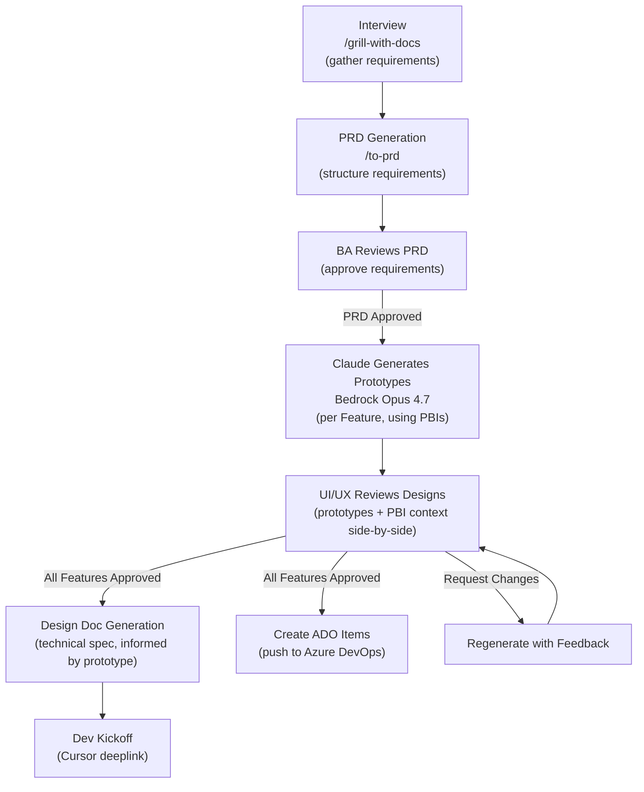
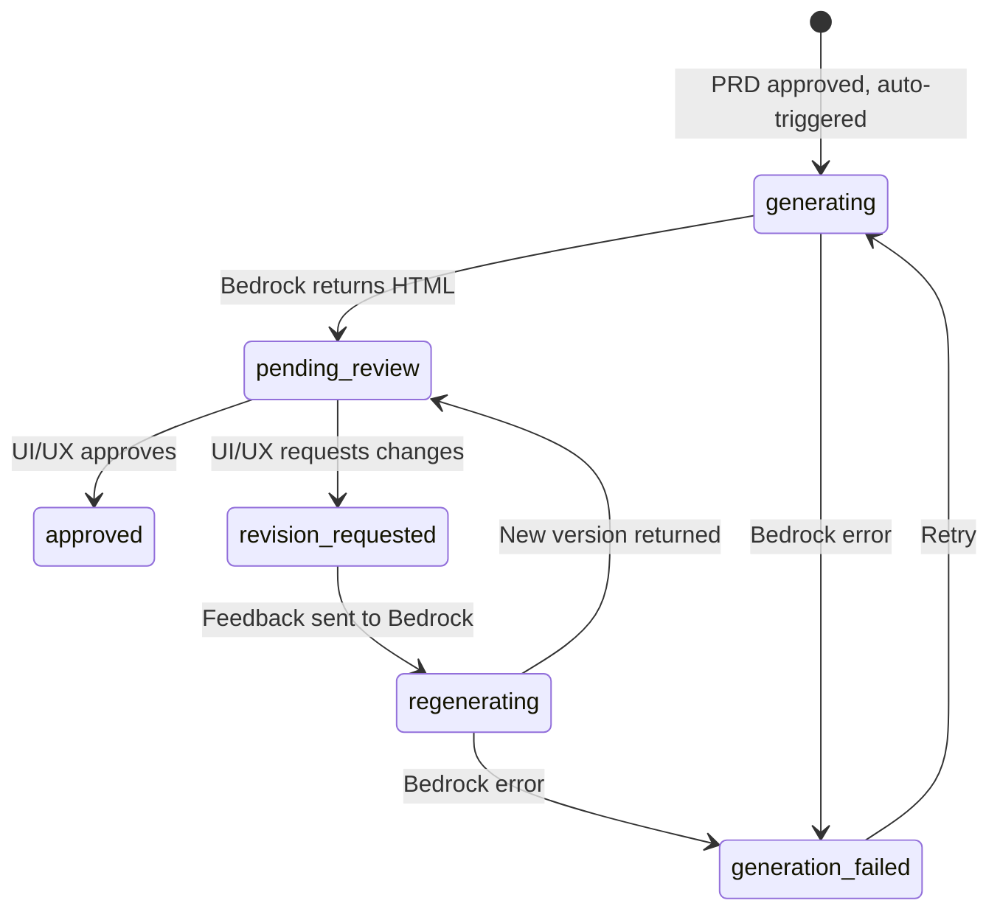
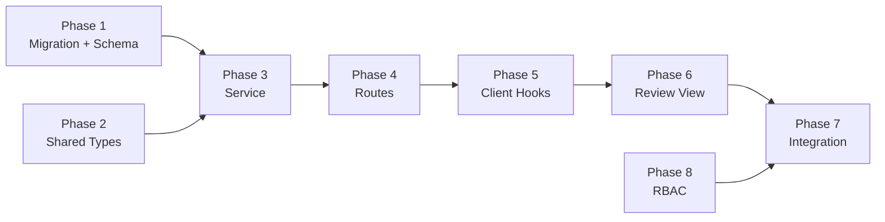

# Claude Design Prototype — Feature-Level Design Generation & Review

## Summary

### What We're Adding

A new pipeline step: **Design Prototype Generation & Review**. After the BA approves a PRD (requirements), Claude Opus 4.7 via AWS Bedrock automatically generates visual HTML prototypes for each Feature. UI/UX reviews these prototypes alongside the PBI requirements, approves or requests regeneration with feedback. Approved prototypes feed into Design Doc generation and ADO work item creation.

### What We're Replacing

Nothing is removed. The existing UI mock system (`UiMockSection` / `UiMockPreview` / `bedrockService.ts`) remains for the wiki-based backlog workflow. This new system is a **parallel track** for the Interview → PRD → Design Doc pipeline, using the same Bedrock infrastructure but with its own DB-backed lifecycle.

### What We're Reusing

| Existing Component | How It's Reused |
|---|---|
| `bedrockService.ts` (`invokeModel`, `UI_MOCK_MODEL_ID`, `UI_MOCK_MAX_TOKENS`) | Same Bedrock call pattern; new prompt builder for Feature-level prototypes |
| `UiMockPreview.tsx` (iframe + srcDoc + versions + fullscreen + feedback) | Embedded inside the new review view |
| `htmlSanitizer.ts` | Applied to all generated HTML before storage |
| `designSystemService.ts` (`getDesignSystemCatalog`) | Design tokens, components, knowledge base bundled into prompt |
| `figmaReferenceService.ts` | Figma screenshot for visual grounding |
| `ReviewReasonModal.tsx` | Approve/reject/request-revision workflow |
| `useChatStream.ts` pattern | Generation progress (polling, not SSE — Bedrock is synchronous) |
| RBAC middleware (`requirePermission`) | Permission gating on routes |
| `can()` client gating | Permission gating on UI actions |

### What We're Modifying

| File | Change |
|---|---|
| `src/server/routes/interviews.ts` | PRD approve handler triggers prototype generation |
| `src/client/components/PrdReviewView.tsx` | After approve, navigate to design prototype view |
| `src/client/components/DesignDocReviewView.tsx` | Receive approved prototype HTML as context for generation |
| `src/client/App.tsx` | Add `/backlog/design-prototype/:id` route |
| `src/server/db/schema.ts` | Add `designPrototypes` and `designPrototypeComments` tables |

---

## Pipeline Flow (Final)



### Role Separation

| Step | Who | What They Approve | Gate Question |
|------|-----|-------------------|---------------|
| PRD Review | **BA** | Requirements: Epics, Features, PBIs, Acceptance Criteria | "Are the requirements correct and complete?" |
| Design Prototype Review | **UI/UX** | Visual design per Feature, with PBI context alongside | "Does the design match our patterns, brand, and UX standards?" |
| Design Doc Review | **Dev Lead** | Technical spec for implementation | "Is this buildable?" |

### Trigger Chain

1. **BA approves PRD** → server automatically triggers Claude Design generation for each Feature in the PRD's `backlogJson`
2. **Claude generates prototypes** → one HTML prototype per Feature → status: `pending_review`
3. **UI/UX reviews** → sees prototype iframe + PBI list side-by-side → approves, rejects, or requests regeneration with feedback
4. **All Features approved** → triggers ADO item creation + Design Doc generation with prototype as context
5. **Design Doc generation** → same existing flow, but the prompt now includes the approved prototype HTML as visual reference

---

## Database Schema

Create migration: `npm run migrate:create -- design-prototypes`

### `design_prototypes`

| Column | Type | Constraints |
|--------|------|-------------|
| `id` | UUID | PK DEFAULT gen_random_uuid() |
| `prd_id` | UUID | NOT NULL FK → prds(id) ON DELETE CASCADE |
| `feature_name` | TEXT | NOT NULL — Feature title from backlog JSON |
| `feature_index` | INTEGER | NOT NULL — position in backlog JSON features array |
| `author_id` | TEXT | NOT NULL — Azure AD OID (PRD author, auto-inherited) |
| `status` | TEXT | NOT NULL DEFAULT 'generating' — see status machine below |
| `mock_html` | TEXT | — generated HTML prototype (full document) |
| `mock_version` | INTEGER | NOT NULL DEFAULT 1 |
| `history` | JSONB | NOT NULL DEFAULT '[]' — array of `{ version, html, feedback, createdAt }` |
| `reviewer_id` | TEXT | — Azure AD OID of UI/UX reviewer |
| `review_comment` | TEXT | — reviewer feedback |
| `reviewed_at` | TIMESTAMPTZ | — when review action was taken |
| `generation_error` | TEXT | — error message if Bedrock call failed |
| `created_at` | TIMESTAMPTZ | NOT NULL DEFAULT now() |
| `updated_at` | TIMESTAMPTZ | NOT NULL DEFAULT now() |

- INDEX on `(prd_id, feature_index)` — ordered listing per PRD
- INDEX on `(status)` — filter queries
- UNIQUE on `(prd_id, feature_index)` — one prototype per Feature per PRD

### `design_prototype_comments`

| Column | Type | Constraints |
|--------|------|-------------|
| `id` | UUID | PK DEFAULT gen_random_uuid() |
| `prototype_id` | UUID | NOT NULL FK → design_prototypes(id) ON DELETE CASCADE |
| `author_id` | TEXT | NOT NULL — Azure AD OID |
| `text` | TEXT | NOT NULL |
| `pin_x` | REAL | — x coordinate (percentage) on the iframe, nullable for general comments |
| `pin_y` | REAL | — y coordinate (percentage) on the iframe |
| `mock_version` | INTEGER | NOT NULL — which version the comment was placed on |
| `resolved` | BOOLEAN | NOT NULL DEFAULT false |
| `resolved_by` | TEXT | — who resolved it |
| `created_at` | TIMESTAMPTZ | NOT NULL DEFAULT now() |

- INDEX on `(prototype_id, created_at)` — chronological listing

---

## Status Machine



| From | To | Triggered By | Side Effects |
|------|----|-------------|-------------|
| (new) | `generating` | PRD approved | Creates row per Feature; calls Bedrock |
| `generating` | `pending_review` | Bedrock success | Stores sanitized HTML; sets `mock_version = 1` |
| `generating` | `generation_failed` | Bedrock error | Stores error message |
| `generation_failed` | `generating` | User clicks "Retry" | Clears error; re-calls Bedrock |
| `pending_review` | `approved` | UI/UX clicks "Approve" | Sets reviewer_id, reviewed_at |
| `pending_review` | `revision_requested` | UI/UX clicks "Request Changes" | Sets reviewer_id, review_comment |
| `revision_requested` | `regenerating` | Author/system sends feedback to Bedrock | Pushes current HTML to history; bumps version |
| `regenerating` | `pending_review` | Bedrock success | Stores new HTML; clears review fields |

**All Features approved check:** When any prototype transitions to `approved`, the server checks if ALL prototypes for that PRD are now `approved`. If yes, it triggers ADO item creation and Design Doc generation.

---

## Server Changes

### Service: `src/server/services/designPrototypeService.ts` (new)

```typescript
// Generation
generatePrototypesForPrd(prdId: string): Promise<void>
  // Reads PRD content + backlogJson → extracts Features
  // For each Feature: creates design_prototypes row, calls generateSinglePrototype()

generateSinglePrototype(prototypeId: string): Promise<void>
  // Loads design catalog (designSystemService)
  // Loads Figma reference (figmaReferenceService)
  // Builds prompt with Feature title, description, PBI list + acceptance criteria
  // Calls invokeModel(prompt, image, UI_MOCK_MODEL_ID, UI_MOCK_MAX_TOKENS)
  // Sanitizes HTML → stores in DB
  // Updates status: generating → pending_review

regeneratePrototype(prototypeId: string, feedback: string): Promise<void>
  // Pushes current HTML to history array
  // Builds regeneration prompt (prior HTML + feedback + design catalog)
  // Calls Bedrock, sanitizes, stores new HTML
  // Bumps mockVersion, clears review fields
  // Updates status: revision_requested → pending_review

// CRUD
listPrototypesForPrd(prdId: string): Promise<DesignPrototypeSummary[]>
getPrototype(id: string): Promise<DesignPrototype | null>

// Review
reviewPrototype(id, { reviewerId, action, comment }): Promise<void>
  // Validates reviewer ≠ author
  // Transitions status
  // On approve: checks if all siblings are approved → triggers downstream

// Comments
addComment(prototypeId, { authorId, text, pinX?, pinY?, mockVersion }): Promise<void>
resolveComment(commentId, resolvedBy): Promise<void>
listComments(prototypeId): Promise<DesignPrototypeComment[]>

// Downstream trigger
checkAllApprovedAndProceed(prdId: string): Promise<void>
  // If all prototypes approved:
  //   1. Create ADO work items from PRD backlogJson
  //   2. Trigger Design Doc generation with prototype HTML as context
```

### Routes: `src/server/routes/designPrototypes.ts` (new)

Mount at `/api/design-prototypes` behind `ensureAuthenticated`.

| Method | Path | Permission | Body / Params | Returns |
|--------|------|------------|---------------|---------|
| `GET` | `/prd/:prdId` | `interviews:view` | — | `DesignPrototypeSummary[]` |
| `GET` | `/:id` | `interviews:view` | — | `DesignPrototype` (full HTML) |
| `POST` | `/:id/regenerate` | `interviews:manage` | `{ feedback }` | `200` |
| `POST` | `/:id/retry` | `interviews:manage` | — | `200` |
| `POST` | `/:id/review` | `design-prototypes:review` | `{ action, comment? }` | `200` |
| `GET` | `/:id/comments` | `interviews:view` | — | `DesignPrototypeComment[]` |
| `POST` | `/:id/comments` | `interviews:manage` | `{ text, pinX?, pinY?, mockVersion }` | `201` |
| `POST` | `/comments/:commentId/resolve` | `interviews:manage` | — | `200` |

### Modification: `src/server/routes/interviews.ts`

In the PRD approve handler (`POST /api/interviews/prds/:prdId/review` with `action: 'approve'`):

```typescript
// After existing design doc creation logic...
// Add: trigger prototype generation
const { generatePrototypesForPrd } = await import('../services/designPrototypeService');
await generatePrototypesForPrd(prdId);
// Return designPrototypeIds in response for client navigation
```

---

## Shared Types

### `src/shared/types/designPrototype.ts` (new)

```typescript
export type DesignPrototypeStatus =
  | 'generating'
  | 'generation_failed'
  | 'pending_review'
  | 'revision_requested'
  | 'regenerating'
  | 'approved';

export interface DesignPrototypeSummary {
  id: string;
  prdId: string;
  featureName: string;
  featureIndex: number;
  authorId: string;
  status: DesignPrototypeStatus;
  mockVersion: number;
  reviewerId?: string;
  reviewComment?: string;
  reviewedAt?: string;
  generationError?: string;
  createdAt: string;
  updatedAt: string;
}

export interface DesignPrototype extends DesignPrototypeSummary {
  mockHtml: string | null;
  history: DesignPrototypeHistoryEntry[];
  pbiRequirements: PbiRequirement[];  // extracted from PRD backlogJson
}

export interface DesignPrototypeHistoryEntry {
  version: number;
  html: string;
  feedback?: string;
  createdAt: string;
}

export interface PbiRequirement {
  title: string;
  description?: string;
  acceptanceCriteria?: string;
}

export interface DesignPrototypeComment {
  id: string;
  prototypeId: string;
  authorId: string;
  authorName?: string;
  text: string;
  pinX?: number;
  pinY?: number;
  mockVersion: number;
  resolved: boolean;
  resolvedBy?: string;
  createdAt: string;
}

export interface ReviewDesignPrototypeRequest {
  action: 'approve' | 'revision_requested';
  comment?: string;
}

export interface RegeneratePrototypeRequest {
  feedback: string;
}
```

---

## Client Changes

### Hook: `src/client/hooks/useDesignPrototypes.ts` (new)

```typescript
usePrototypesForPrd(prdId: string)         // GET /api/design-prototypes/prd/:prdId
usePrototype(id: string)                    // GET /api/design-prototypes/:id (poll while generating)
useRegeneratePrototype()                    // POST /api/design-prototypes/:id/regenerate
useRetryPrototype()                         // POST /api/design-prototypes/:id/retry
useReviewPrototype()                        // POST /api/design-prototypes/:id/review
usePrototypeComments(prototypeId: string)   // GET /api/design-prototypes/:id/comments
useAddPrototypeComment()                    // POST /api/design-prototypes/:id/comments
useResolvePrototypeComment()                // POST /api/design-prototypes/comments/:id/resolve
```

### Component: `src/client/components/DesignPrototypeReviewView.tsx` (new)

Rendered at `/backlog/design-prototype/:prdId`. Full-page split-pane layout:

**Left panel — Feature tabs + PBI requirements:**
- Tab bar of Feature names (from PRD backlogJson)
- Selected Feature shows its PBIs with title, description, acceptance criteria
- Status badge per Feature (generating / pending_review / approved / etc.)
- Overall progress indicator: "3 of 5 Features approved"

**Right panel — Prototype preview + actions:**
- `UiMockPreview` component (reused) with the selected Feature's HTML
- Version dropdown (from history)
- Fullscreen toggle
- Generation progress/error state when status is `generating` / `generation_failed`

**Bottom/overlay — Comments + feedback:**
- Comment list for current Feature (filterable: open / resolved)
- Pin indicators overlaid on iframe (click to place new pin)
- Feedback textarea for regeneration

**Header — Review controls:**
- "Approve" / "Request Changes" buttons (UI/UX reviewer, per Feature)
- "Regenerate" button (sends feedback to Bedrock)
- "Retry" button (on generation_failed)
- Back button → `/backlog/prd/:prdId`
- Overall status: "Waiting for UI/UX approval (3/5 approved)"

### Component: `src/client/components/DesignPrototypeReviewView.module.css` (new)

### Modifications

**`PrdReviewView.tsx`:**
- On PRD approve response, if `designPrototypeIds` returned, navigate to `/backlog/design-prototype/:prdId`

**`App.tsx`:**
- Add route: `location.pathname.startsWith('/backlog/design-prototype/')` → `<DesignPrototypeReviewView />`
- Add lazy import for `DesignPrototypeReviewView`

**`InterviewsDashboard.tsx`:**
- Add "Design Prototypes" section or tab showing prototypes pending UI/UX review

---

## RBAC

### New Permission

| Key | Category | Roles | Purpose |
|-----|----------|-------|---------|
| `design-prototypes:review` | design-prototypes | admin, member | Approve/reject design prototypes (UI/UX reviewers) |

Existing `interviews:view` covers read access. Existing `interviews:manage` covers regeneration and comments. The new permission specifically gates the approve/reject action so it can be assigned to UI/UX team members.

---

## Bedrock Integration

### Environment Variables (already configured)

```
BEDROCK_UI_MOCK_MODEL_ID=us.anthropic.claude-opus-4-7   ✅ correct format
BEDROCK_UI_MOCK_MAX_TOKENS=16000                         ✅ sufficient for single-Feature prototypes
AWS_REGION=us-east-2                                     ✅ Opus 4.7 available
```

### Prompt Structure

The prototype generation prompt reuses the existing `invokeModel()` from `bedrockService.ts` with:

- **System context** (bundled from `designSystemService`):
  - UI knowledge base (personas, navigation patterns, design foundations)
  - Component catalog (names + JSDoc descriptions from MaxView repo)
  - Route list with layout hints
  - Figma screenshot for visual grounding

- **User prompt** (per Feature):
  - Feature title and description
  - PBI list with acceptance criteria (from PRD `backlogJson`)
  - Screen archetype hint (list, detail, form, modal, dashboard, settings)
  - Multi-state generation instructions (see below)

- **Regeneration prompt** (on feedback):
  - Prior HTML (between `<!-- CONTENT_START -->` and `<!-- CONTENT_END -->`)
  - UI/UX feedback text
  - Unresolved comments
  - "Revise the HTML to address this feedback"

### Multi-State Generation (Static Panels)

Each prototype is a **single HTML page with multiple state sections** stacked vertically. The prototype is NOT interactive (iframe sandbox blocks JS). Instead, all states are rendered as separate visual panels so UI/UX can review every state in one scroll.

**Prompt instruction to Claude:**

```
For this Feature, generate a self-contained HTML document with the following state
sections, separated by clear section headers and horizontal rules:

1. DEFAULT STATE — Populated with realistic sample data that matches the Feature's
   domain. Show the primary happy-path view with all PBI requirements represented.

2. EMPTY STATE — The view when no records/data exist yet. Show appropriate empty
   illustrations, helpful messaging, and calls-to-action (e.g. "No shifts scheduled.
   Create your first shift.").

3. ERROR STATE — Show inline form validation errors, field-level error messages,
   and/or an error banner for API failures. Use realistic error messages that match
   the acceptance criteria (e.g. "End date must be after start date").

4. LOADING STATE — Show skeleton placeholders that match the default layout structure.
   Use CSS-only animated pulse placeholders (no JavaScript). Skeleton shapes should
   mirror the actual content layout (cards → card skeletons, table → row skeletons).

Each section must be wrapped in a container with:
- A sticky section header: "✅ Default State", "📭 Empty State", "⚠️ Error State",
  "⏳ Loading State"
- A subtle background color difference to visually separate sections
- Matching the application's design system tokens throughout
```

**Why static panels over interactive JS:**
- Security: iframe `sandbox="allow-same-origin"` blocks all scripts
- Reliability: no risk of generated JS bugs confusing reviewers
- Reviewability: all states visible in one scroll — no clicking required
- Cost: fewer output tokens than interactive state-switching logic
- Upgradeable: can move to interactive JS (Option B) in a later iteration by adding `allow-scripts` to the sandbox

**Token budget:** With 4 states per Feature, expect ~12K–16K output tokens. The current `BEDROCK_UI_MOCK_MAX_TOKENS=16000` should suffice for most Features. Bump to `24000` if prototypes with many PBIs get truncated.

### How It Differs from Existing UI Mocks

| Aspect | Existing UI Mocks (wiki backlog) | New Design Prototypes (interview pipeline) |
|--------|----------------------------------|-------------------------------------------|
| Scope | Per PBI, wiki Feature context | Per Feature, PRD backlog context |
| Storage | ADO wiki draft JSON | PostgreSQL `design_prototypes` table |
| Trigger | Manual button click | Auto on PRD approval |
| Review | Informal (no status machine) | Formal UI/UX approve/reject workflow |
| Comments | No comment system | Pin-based annotation comments |
| Downstream | Figma export | Design Doc generation + ADO item creation |
| Model | `BEDROCK_UI_MOCK_MODEL_ID` | Same — `BEDROCK_UI_MOCK_MODEL_ID` |

---

## Files Created / Modified

| Action | Path |
|--------|------|
| Create | `migrations/<ts>_design-prototypes.sql` |
| Edit   | `src/server/db/schema.ts` (add tables + relations) |
| Create | `src/shared/types/designPrototype.ts` |
| Create | `src/server/services/designPrototypeService.ts` |
| Create | `src/server/routes/designPrototypes.ts` |
| Edit   | `src/server/index.ts` (mount route — requires permission) |
| Edit   | `src/server/routes/interviews.ts` (PRD approve triggers generation) |
| Create | `src/client/hooks/useDesignPrototypes.ts` |
| Create | `src/client/components/DesignPrototypeReviewView.tsx` |
| Create | `src/client/components/DesignPrototypeReviewView.module.css` |
| Edit   | `src/client/App.tsx` (add route — requires permission) |
| Edit   | `src/client/components/PrdReviewView.tsx` (navigate on approve) |
| Edit   | `src/client/components/InterviewsDashboard.tsx` (add prototype section) |

---

## Phase Summary



**Parallelism:**
- Phase 1 + Phase 2 — independent, run in parallel
- Phase 3 — depends on both Phase 1 and 2
- Phase 4 — depends on Phase 3
- Phase 5 — depends on Phase 4
- Phase 6 — depends on Phase 5
- Phase 7 — depends on Phase 6 + Phase 8
- Phase 8 — independent of Phases 1–6, can run anytime before Phase 7
