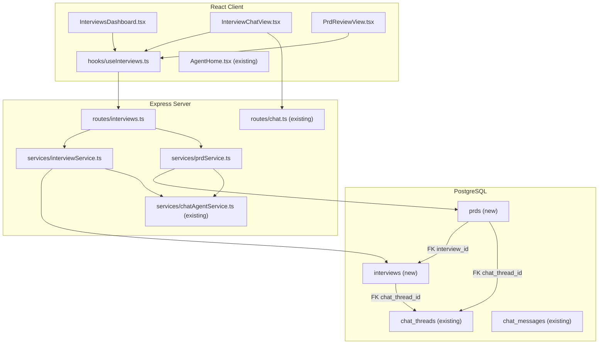
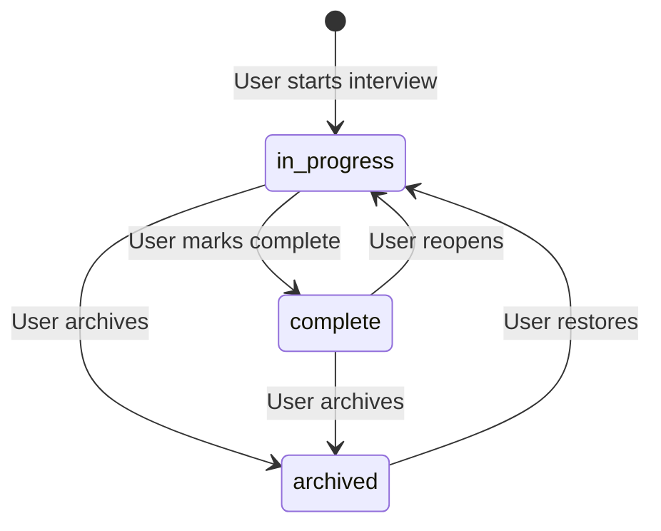
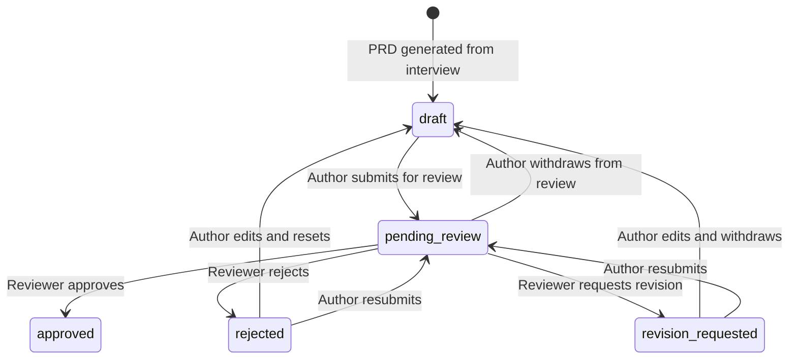
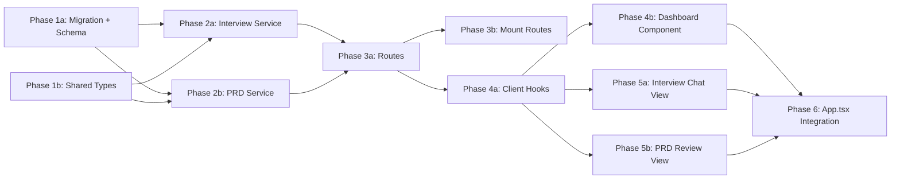

# Interview & PRD Workflow

## Current State

The application has a nav item labeled **"Interview"** that navigates to `/backlog` and renders `BacklogView.tsx` — a stub component containing only an `<h1>Interview</h1>` heading. The permission `backlog:view` gates access.

Meanwhile, the real interview workflow exists only as Cursor SDK skills in the MaxView ADO repo:

- **`/grill-with-docs`** — a structured design-interview skill that loads project context (CONTEXT.md, AGENTS.md, ADRs, UI knowledge base) and challenges the user's design decisions through a multi-question conversation.
- **`/to-prd`** — a PRD generation skill that takes interview context and produces a structured PRD markdown document plus a `backlog.json` with Epics, Features, PBIs, and TBIs organized into waves.

Today, users can already invoke these skills from `AgentHome` (`/home`) via the `/` skill picker. However, there is no way to:
- Track which chat threads are design interviews vs. free-form chats
- See a dashboard of all interviews and their statuses
- Transition from interview to PRD generation with a single click
- Review, edit, approve, or reject a generated PRD in a dedicated UI
- Track PRD approval status across the team

## Architecture



## Database Schema

Create a single migration: `npm run migrate:create -- interview-prd-tables`

### `interviews`

| Column | Type | Constraints |
|--------|------|-------------|
| `id` | UUID | PK DEFAULT gen_random_uuid() |
| `chat_thread_id` | UUID | NOT NULL UNIQUE FK → chat_threads(id) ON DELETE CASCADE |
| `author_id` | TEXT | NOT NULL — Azure AD OID of the user who started the interview |
| `title` | TEXT | NOT NULL DEFAULT 'Untitled Interview' |
| `project` | TEXT | NOT NULL — ADO project name |
| `repo` | TEXT | NOT NULL — ADO repo name |
| `status` | TEXT | NOT NULL DEFAULT 'in_progress' — enum: in_progress, complete, archived |
| `created_at` | TIMESTAMPTZ | NOT NULL DEFAULT now() |
| `updated_at` | TIMESTAMPTZ | NOT NULL DEFAULT now() |

- INDEX on `(author_id, updated_at DESC)` — dashboard query
- INDEX on `(status)` — filter queries
- UNIQUE on `chat_thread_id` — one interview per thread

### `prds`

| Column | Type | Constraints |
|--------|------|-------------|
| `id` | UUID | PK DEFAULT gen_random_uuid() |
| `interview_id` | UUID | FK → interviews(id) ON DELETE SET NULL — nullable for standalone PRDs |
| `chat_thread_id` | UUID | FK → chat_threads(id) ON DELETE CASCADE — the to-prd conversation |
| `author_id` | TEXT | NOT NULL — Azure AD OID |
| `title` | TEXT | NOT NULL DEFAULT 'Untitled PRD' |
| `content` | TEXT | NOT NULL DEFAULT '' — PRD markdown stored directly in DB |
| `backlog_json` | JSONB | — structured backlog output (waves, items) |
| `status` | TEXT | NOT NULL DEFAULT 'draft' — enum: draft, pending_review, approved, rejected, revision_requested |
| `reviewer_id` | TEXT | — Azure AD OID of the reviewer |
| `review_comment` | TEXT | — reviewer's feedback |
| `reviewed_at` | TIMESTAMPTZ | — when the review action was taken |
| `created_at` | TIMESTAMPTZ | NOT NULL DEFAULT now() |
| `updated_at` | TIMESTAMPTZ | NOT NULL DEFAULT now() |

- INDEX on `(author_id, updated_at DESC)` — dashboard query
- INDEX on `(interview_id)` — join query
- INDEX on `(status)` — filter queries

After creating the migration, update `src/server/db/schema.ts` with matching `pgTable` definitions and `relations()`.

## Status Workflows

### Interview Status Machine



**Interview transition rules:**

| From | To | Triggered by | Preconditions | Side effects |
|------|----|-------------|---------------|-------------|
| (new) | `in_progress` | `createInterview()` | — | Creates chat_thread with grill-with-docs kickoff; sets `updated_at` |
| `in_progress` | `complete` | Author clicks "Mark Complete" | Chat thread exists and has at least one agent response | Sets `updated_at`; enables "Generate PRD" button in UI |
| `in_progress` | `archived` | Author clicks "Archive" | — | Sets `updated_at`; hides from default dashboard view |
| `complete` | `in_progress` | Author clicks "Reopen" | — | Sets `updated_at`; re-enables chat input |
| `complete` | `archived` | Author clicks "Archive" | — | Sets `updated_at` |
| `archived` | `in_progress` | Author clicks "Restore" | — | Sets `updated_at`; shows in dashboard again |

**Who can trigger transitions:**
- Only the **author** (the user whose `author_id` matches) can transition interview status.
- The user must also have the `interviews:manage` RBAC permission.
- Both checks are enforced server-side in `interviewService.ts` — RBAC via `requirePermission('interviews:manage')` middleware, author ownership via service-layer validation.

### PRD Status Machine



**PRD transition rules:**

| From | To | Triggered by | Preconditions | Side effects |
|------|----|-------------|---------------|-------------|
| (new) | `draft` | `createPrd()` | Interview must exist and be `complete` or `in_progress` | Creates chat_thread with to-prd kickoff; injects interview transcript as context |
| `draft` | `pending_review` | Author clicks "Submit for Review" | `content` must be non-empty | Sets `updated_at`; clears any previous `reviewer_id`, `review_comment`, `reviewed_at` |
| `pending_review` | `approved` | Reviewer clicks "Approve" | Reviewer must not be the author | Sets `reviewer_id`, `review_comment`, `reviewed_at`, `updated_at` |
| `pending_review` | `rejected` | Reviewer clicks "Reject" | Reviewer must not be the author; `comment` required | Sets `reviewer_id`, `review_comment`, `reviewed_at`, `updated_at` |
| `pending_review` | `revision_requested` | Reviewer clicks "Request Revision" | Reviewer must not be the author; `comment` required | Sets `reviewer_id`, `review_comment`, `reviewed_at`, `updated_at` |
| `pending_review` | `draft` | Author clicks "Withdraw" | Only the author can withdraw | Clears `reviewer_id`, `review_comment`, `reviewed_at`; sets `updated_at` |
| `revision_requested` | `draft` | Author edits content | Only the author | Clears review fields; sets `updated_at` |
| `revision_requested` | `pending_review` | Author clicks "Resubmit for Review" | `content` must be non-empty | Clears previous review fields; sets `updated_at` |
| `rejected` | `draft` | Author edits content | Only the author | Clears review fields; sets `updated_at` |
| `rejected` | `pending_review` | Author clicks "Resubmit for Review" | `content` must be non-empty | Clears previous review fields; sets `updated_at` |
| `approved` | (terminal) | — | — | No further transitions; PRD is finalized |

**Who can trigger transitions:**
- **All PRD actions require `interviews:manage`** RBAC permission (enforced at the route level via middleware).
- **Author actions** (submit, withdraw, resubmit, edit): additionally require `prd.authorId === requestingUserId`. Enforced in `prdService.ts`.
- **Reviewer actions** (approve, reject, request revision): additionally require `reviewerId !== prd.authorId` (you cannot review your own PRD). Enforced in `prdService.ts`.
- **Approved is terminal**: once approved, the PRD is locked. No edits or status changes are allowed. If a new version is needed, the user generates a new PRD from the interview.
- **Users with only `interviews:view`** can read PRDs but cannot trigger any transition.

**Server-side enforcement:** The route middleware checks `interviews:manage` first. Then `prdService.ts` validates the state transition is legal and the requesting user has the right relationship (author vs. non-author). Invalid transitions return `409 Conflict`. Unauthorized ownership returns `403 Forbidden`.

## Server Changes

### Service: `src/server/services/interviewService.ts` (new)

Follow patterns from `src/server/services/chatThreadRepository.ts`.

- `createInterview(opts: { userId, project, repo, title?, model? }): Promise<{ interviewId, threadId }>` — creates a chat_thread with grill-with-docs kickoff, then inserts an interviews row referencing it. Returns both IDs.
- `listInterviews(userId: string, filters?: { status? }): Promise<InterviewSummary[]>` — dashboard listing with pagination, ordered by updated_at DESC.
- `getInterview(id: string): Promise<Interview | null>` — loads interview metadata + chat thread summary.
- `updateInterviewStatus(id: string, status: InterviewStatus): Promise<void>` — transitions status (in_progress → complete → archived).
- `updateInterviewTitle(id: string, title: string): Promise<void>` — user renames the interview.

### Service: `src/server/services/prdService.ts` (new)

- `createPrd(opts: { interviewId, userId, project, repo, model? }): Promise<{ prdId, threadId }>` — creates a new chat_thread with to-prd kickoff (injecting the interview conversation as transcript context), inserts a prds row. Returns both IDs.
- `listPrds(userId?: string, filters?: { status?, interviewId? }): Promise<PrdSummary[]>` — dashboard listing.
- `getPrd(id: string): Promise<Prd | null>` — loads full PRD with content.
- `updatePrdContent(id: string, content: string): Promise<void>` — manual edits to the markdown.
- `updatePrdBacklog(id: string, backlog: unknown): Promise<void>` — updates the backlog JSON.
- `submitForReview(id: string): Promise<void>` — transitions draft → pending_review.
- `reviewPrd(id: string, opts: { reviewerId, action: 'approve' | 'reject' | 'request_revision', comment? }): Promise<void>` — records the review decision.
- `syncPrdFromThread(prdId: string, threadId: string): Promise<void>` — called after the to-prd agent completes; reads PRD/backlog output files from the workspace and saves to DB content/backlog_json columns.

### Routes: `src/server/routes/interviews.ts` (new)

Mount at `/api/interviews` behind `ensureAuthenticated` in `src/server/index.ts`.

**Interview endpoints:**

| Method | Path | Permission | Body / Params | Returns |
|--------|------|------------|---------------|---------|
| `GET` | `/` | `interviews:view` | `?status=in_progress,complete` | `InterviewSummary[]` |
| `POST` | `/` | `interviews:manage` | `{ project, repo, title?, model? }` | `201` + `{ interviewId, threadId }` |
| `GET` | `/:id` | `interviews:view` | — | `Interview` |
| `PATCH` | `/:id` | `interviews:manage` | `{ status?, title? }` | `200` |
| `DELETE` | `/:id` | `interviews:manage` | — | `204` |

**PRD endpoints (nested under interviews):**

| Method | Path | Permission | Body / Params | Returns |
|--------|------|------------|---------------|---------|
| `GET` | `/prds` | `interviews:view` | `?status=draft,pending_review,approved` | `PrdSummary[]` |
| `POST` | `/:interviewId/prds` | `interviews:manage` | `{ model? }` | `201` + `{ prdId, threadId }` |
| `GET` | `/prds/:prdId` | `interviews:view` | — | `Prd` (full content) |
| `PUT` | `/prds/:prdId/content` | `interviews:manage` | `{ content }` | `200` |
| `POST` | `/prds/:prdId/submit` | `interviews:manage` | — | `200` (→ pending_review) |
| `POST` | `/prds/:prdId/review` | `interviews:manage` | `{ action, comment? }` | `200` |

**RBAC middleware usage:** Read-only endpoints use `requirePermission('interviews:view')`. Write/mutate endpoints use `requirePermission('interviews:manage')`. Both permissions use the existing `requirePermission` middleware from `src/server/middleware/rbac.ts`.

## Shared Types

### `src/shared/types/interview.ts` (new)

```typescript
export type InterviewStatus = 'in_progress' | 'complete' | 'archived';

export interface InterviewSummary {
  id: string;
  chatThreadId: string;
  authorId: string;
  authorName?: string;
  title: string;
  project: string;
  repo: string;
  status: InterviewStatus;
  prdCount: number;
  createdAt: string;
  updatedAt: string;
}

export interface Interview extends InterviewSummary {
  prds: PrdSummary[];
}

export type PrdStatus = 'draft' | 'pending_review' | 'approved' | 'rejected' | 'revision_requested';

export interface PrdSummary {
  id: string;
  interviewId: string | null;
  chatThreadId: string;
  authorId: string;
  authorName?: string;
  title: string;
  status: PrdStatus;
  reviewerId?: string;
  reviewerName?: string;
  reviewComment?: string;
  reviewedAt?: string;
  createdAt: string;
  updatedAt: string;
}

export interface Prd extends PrdSummary {
  content: string;
  backlogJson?: unknown;
}

// API request/response shapes
export interface CreateInterviewRequest {
  project: string;
  repo: string;
  title?: string;
  model?: string;
}

export interface CreateInterviewResponse {
  interviewId: string;
  threadId: string;
}

export interface CreatePrdRequest {
  model?: string;
}

export interface CreatePrdResponse {
  prdId: string;
  threadId: string;
}

export interface ReviewPrdRequest {
  action: 'approve' | 'reject' | 'request_revision';
  comment?: string;
}
```

## Client Changes

### Hook: `src/client/hooks/useInterviews.ts` (new)

TanStack Query hooks following the pattern in `useChatThreads.ts`:

```typescript
export function useInterviewList(filters?: { status?: InterviewStatus }) {
  return useQuery<InterviewSummary[]>({
    queryKey: ['interviews', filters],
    queryFn: () => fetch('/api/interviews?' + new URLSearchParams(filters)).then(r => r.json()),
    staleTime: 30_000,
  });
}

export function usePrdList(filters?: { status?: PrdStatus }) {
  return useQuery<PrdSummary[]>({
    queryKey: ['prds', filters],
    queryFn: () => fetch('/api/interviews/prds?' + new URLSearchParams(filters)).then(r => r.json()),
    staleTime: 30_000,
  });
}

export function useCreateInterview() { /* useMutation wrapping POST /api/interviews */ }
export function useCreatePrd() { /* useMutation wrapping POST /api/interviews/:id/prds */ }
export function useUpdatePrdContent() { /* useMutation wrapping PUT /api/interviews/prds/:id/content */ }
export function useSubmitPrd() { /* useMutation wrapping POST /api/interviews/prds/:id/submit */ }
export function useReviewPrd() { /* useMutation wrapping POST /api/interviews/prds/:id/review */ }
```

### Component: `src/client/components/InterviewsDashboard.tsx` (new, replaces BacklogView)

The dashboard is the landing page at `/backlog`. Two-tab layout:

**Interviews tab:**
- Card-based list of interviews sorted by updated_at DESC
- Each card shows: title, project/repo, status badge (in_progress | complete | archived), PRD count, created date
- Status filter pills at top (All | In Progress | Complete | Archived)
- "Start New Interview" button → creates interview + navigates to chat view — `{can('interviews:manage') && <StartButton />}`
- Click card → navigates to `/backlog/interview/:id`

**PRDs tab:**
- Card-based list of PRDs sorted by updated_at DESC
- Each card shows: title, status badge (color-coded: draft=gray, pending_review=amber, approved=green, rejected=red, revision_requested=orange), author, reviewer, reviewed date
- Status filter pills
- Click card → navigates to `/backlog/prd/:id`

**Design:**
- CSS Module: `InterviewsDashboard.module.css`
- Use CSS variables from `App.css`
- Follow the card grid pattern used in other views

### Component: `src/client/components/InterviewChatView.tsx` (new)

Rendered at `/backlog/interview/:id`. Reuses the chat infrastructure from `AgentHome.tsx` with interview-specific chrome:

- **Header**: Interview title (editable inline), status badge, project/repo pills
- **Chat area**: Reuses `useChatStream` hook with the interview's `chatThreadId` for SSE streaming. Renders messages with the same `MessageBubble` pattern from `AgentHome`.
- **Action bar** (bottom-right or header):
  - "Mark Complete" button — transitions status to `complete`
  - "Generate PRD" button (visible when status = complete) — calls `POST /api/interviews/:id/prds`, then navigates to the PRD review view
- **Back button** → returns to dashboard

### Component: `src/client/components/PrdReviewView.tsx` (new)

Rendered at `/backlog/prd/:id`. Three-tab layout inspired by `PRDPreviewDrawer.tsx` but as a full page:

- **Preview tab**: Rendered markdown with table of contents sidebar (reuse `buildToc` / `slugify` pattern from `PRDPreviewDrawer`)
- **Edit tab**: Markdown textarea with save/discard controls
- **Backlog tab**: Structured backlog view (reuse `BacklogView` pattern from `PRDPreviewDrawer`)

**Review controls** (visible in header when status allows AND `can('interviews:manage')`):
- Author can: "Submit for Review" (draft → pending_review), "Withdraw" (pending_review → draft)
- Non-author with `interviews:manage` can: "Approve" (green), "Reject" (red), "Request Revision" (orange) — reject and request-revision require a comment
- Users with only `interviews:view` see the PRD in read-only mode (no edit tab, no review buttons)
- Status badge + reviewer name + review timestamp always displayed

**Chat thread link**: "View generation conversation" button opens the to-prd thread in a side panel or navigates to it

### `App.tsx` changes

- Replace the `BacklogView` lazy import with `InterviewsDashboard`
- Add sub-route matching for `/backlog/interview/:id` → `InterviewChatView`
- Add sub-route matching for `/backlog/prd/:id` → `PrdReviewView`
- All wrapped in `Suspense` + `ErrorBoundary`

## Key Design Decisions

- **interviews references chat_threads via FK** rather than duplicating message storage. The interview table is a thin metadata layer; all conversation data stays in the existing chat infrastructure. This avoids schema duplication, reuses SSE streaming and message persistence, and means improvements to the chat system automatically benefit interviews. The trade-off is that the interview lifecycle is coupled to chat_threads — deleting a chat_thread cascades to the interview. This is acceptable because the interview IS the conversation.

- **PRD markdown stored in DB TEXT column** rather than on the filesystem. The existing system writes PRD files to ephemeral workspace directories that get cleaned up. Storing in PostgreSQL provides persistence across deployments, works on Azure App Service (ephemeral filesystem), and makes the PRD the single source of truth. The `syncPrdFromThread` function bridges the gap: after the to-prd agent finishes, it reads the output files and saves them to the DB.

- **Separate thread for PRD generation** rather than continuing the interview thread. This keeps the interview conversation and PRD generation conversation as distinct, trackable entities. The PRD thread carries forward context from the interview (via the `transcript` field in `ChatThreadKickoff`), so the agent has full context without polluting the original interview.

- **Three-tier RBAC gating** using two new permissions in the `interviews` category:

  | Permission | Category | Grants | Default roles |
  |------------|----------|--------|---------------|
  | `interviews:view` | interviews | Read-only: see dashboard, read interviews, read PRDs | admin, member, viewer |
  | `interviews:manage` | interviews | Full access: create interviews, generate/edit PRDs, approve/reject/request revision, change status | admin, member |

  The existing `backlog:view` permission is **retired** (removed from the permission catalog and replaced by `interviews:view` in all route guards and client `can()` checks). The Phase 6 migration seeds these two new permissions and assigns them to the appropriate default roles.

  **Server enforcement**: Read endpoints use `requirePermission('interviews:view')`. Write/mutate endpoints use `requirePermission('interviews:manage')`. The reviewer-cannot-be-author rule is enforced as business logic in `prdService.ts` on top of the RBAC check.

  **Client enforcement**: The `can()` function from `useAppShell` gates UI elements — "Start New Interview", "Generate PRD", "Submit for Review", "Approve/Reject" buttons are hidden when the user lacks `interviews:manage`. The dashboard and detail views render in read-only mode for users with only `interviews:view`.

- **Reuse `/backlog` route** rather than creating `/interviews`. The nav item already says "Interview" and points to `/backlog`. Adding sub-routes (`/backlog/interview/:id`, `/backlog/prd/:id`) keeps the URL structure clean and avoids a nav restructure. The route guard in `App.tsx` changes from `can('backlog:view')` to `can('interviews:view')`.

## Phase Summary and Parallelization



**Multitask parallelism:**

- **Phase 1** (1a + 1b) — no dependencies on each other; run in parallel. 1a creates the DB tables and Drizzle schema; 1b defines the TypeScript interfaces.
- **Phase 2** (2a + 2b) — both depend on Phase 1 completing. 2a (interview service) and 2b (PRD service) can run in parallel since they operate on separate tables with no cross-imports.
- **Phase 3** (3a then 3b) — 3a creates the routes file importing from both services; 3b mounts it in index.ts (requires user permission per scope-discipline rule). Run sequentially.
- **Phase 4** (4a + 4b) — 4a creates hooks (depends on 3a for API contract); 4b creates the dashboard (depends on 4a hooks). Run 4a first, then 4b can start once hooks are defined.
- **Phase 5** (5a + 5b) — both depend on 4a hooks. Can run in parallel since they're separate components.
- **Phase 6** — depends on all Phase 4-5 components. Single task: wire everything into App.tsx.

## Files Changed / Created

| Action | Path |
|--------|------|
| Create | `migrations/<ts>_interview-prd-tables.sql` (tables + RBAC permissions + retire `backlog:view`) |
| Edit   | `src/server/db/schema.ts` |
| Create | `src/shared/types/interview.ts` |
| Create | `src/server/services/interviewService.ts` |
| Create | `src/server/services/prdService.ts` |
| Create | `src/server/routes/interviews.ts` |
| Edit   | `src/server/index.ts` (mount route — requires permission) |
| Create | `src/client/hooks/useInterviews.ts` |
| Create | `src/client/components/InterviewsDashboard.tsx` |
| Create | `src/client/components/InterviewsDashboard.module.css` |
| Create | `src/client/components/InterviewChatView.tsx` |
| Create | `src/client/components/InterviewChatView.module.css` |
| Create | `src/client/components/PrdReviewView.tsx` |
| Create | `src/client/components/PrdReviewView.module.css` |
| Edit   | `src/client/App.tsx` (route matching + `can('interviews:view')` guard — requires permission) |
| Delete | `src/client/components/BacklogView.tsx` (replaced) |
| Delete | `src/client/components/BacklogView.css` (replaced) |
