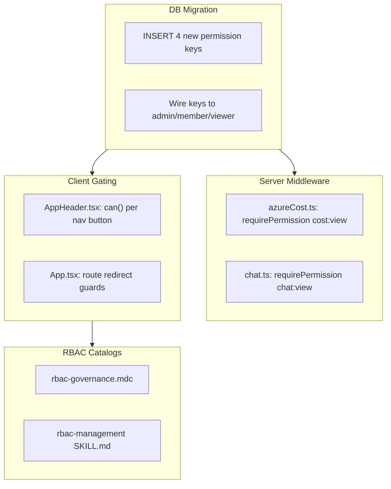
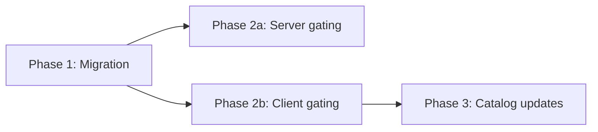

# Menu View RBAC

## Current State

Only the **Admin** nav button is gated with `can('admin:roles')` in [`AppHeader.tsx`](../src/client/components/AppHeader.tsx). The remaining five menu items (Calendar, Planning, Cloud Cost, Backlog) and Agent Studio render unconditionally for all authenticated users. On the server side, only `/api/admin/*` uses `requirePermission`; all other route files rely solely on `ensureAuthenticated`.

## New Permission Keys

| Key | Category | Description | admin | member | viewer |
|-----|----------|-------------|-------|--------|--------|
| `calendar:view` | calendar | View calendar page | Y | Y | |
| `planning:view` | planning | View planning analytics | Y | Y | Y |
| `backlog:view` | backlog | View backlog page | Y | Y | |
| `chat:view` | chat | Access Agent Studio | Y | Y | |
| `cost:view` | cost | *(already exists)* | Y | | Y |

**Home** remains always visible -- no permission key needed (fallback page).

## Architecture



---

## Phase 1 -- Database Migration

Create `migrations/<timestamp>_add-menu-view-permissions.sql`:

```sql
-- Up Migration
INSERT INTO app_permissions (id, key, description, category) VALUES
  (gen_random_uuid(), 'calendar:view', 'View calendar page', 'calendar'),
  (gen_random_uuid(), 'planning:view', 'View planning analytics pages', 'planning'),
  (gen_random_uuid(), 'backlog:view',  'View backlog page', 'backlog'),
  (gen_random_uuid(), 'chat:view',     'Access Agent Studio chat', 'chat');

-- admin gets all 4
INSERT INTO app_role_permissions (role_id, permission_id)
SELECT r.id, p.id FROM app_roles r, app_permissions p
WHERE r.name = 'admin' AND p.key IN ('calendar:view','planning:view','backlog:view','chat:view');

-- member gets all 4
INSERT INTO app_role_permissions (role_id, permission_id)
SELECT r.id, p.id FROM app_roles r, app_permissions p
WHERE r.name = 'member' AND p.key IN ('calendar:view','planning:view','backlog:view','chat:view');

-- viewer gets planning:view only (already has cost:view)
INSERT INTO app_role_permissions (role_id, permission_id)
SELECT r.id, p.id FROM app_roles r, app_permissions p
WHERE r.name = 'viewer' AND p.key = 'planning:view';

-- Down Migration
DELETE FROM app_permissions WHERE key IN ('calendar:view','planning:view','backlog:view','chat:view');
```

---

## Phase 2a -- Server Route Gating

**[`src/server/routes/azureCost.ts`](../src/server/routes/azureCost.ts)** -- Add router-level middleware:

```typescript
import { requirePermission } from '../middleware/rbac';
router.use(requirePermission('cost:view'));
```

**[`src/server/routes/chat.ts`](../src/server/routes/chat.ts)** -- Add router-level middleware:

```typescript
import { requirePermission } from '../middleware/rbac';
router.use(requirePermission('chat:view'));
```

**Note:** Calendar and Planning data comes from shared endpoints in `api.ts` (workitems, cycle-time, stats). Backlog endpoints are also in `api.ts`. Per-route gating in `api.ts` would be a larger refactor (extracting sub-routers). This is deferred as a follow-up. Client-side gating provides the immediate access control layer.

---

## Phase 2b -- Client Menu Gating

**[`src/client/components/AppHeader.tsx`](../src/client/components/AppHeader.tsx)** -- Wrap each nav button (except Home) in `can()` guards:

```tsx
{can('calendar:view') && (
  <button className={`view-btn ${currentView === 'calendar' ? 'active' : ''}`}
    onClick={onNavigateCalendar}>Calendar</button>
)}
{can('planning:view') && (
  <button ...>Planning</button>
)}
{can('cost:view') && (
  <button ...>Cloud Cost</button>
)}
{can('backlog:view') && (
  <button ...>Backlog</button>
)}
```

Gate Agent Studio:

```tsx
{onOpenAgentChat && can('chat:view') && (
  <button className="agent-launch-btn" ...>Agent Studio</button>
)}
```

**[`src/client/App.tsx`](../src/client/App.tsx)** -- Expand the existing admin route guard `useEffect` to cover all gated views:

```tsx
useEffect(() => {
  if (!permissionsLoaded) return;
  if (currentView === 'admin' && !can('admin:roles')) navigate('/home');
  if (currentView === 'calendar' && !can('calendar:view')) navigate('/home');
  if (currentView === 'planning' && !can('planning:view')) navigate('/home');
  if (currentView === 'cloudcost' && !can('cost:view')) navigate('/home');
  if (currentView === 'backlog' && !can('backlog:view')) navigate('/home');
}, [currentView, permissionsLoaded, can, navigate]);
```

Also gate the `ChatAgentPanel` open flow: suppress `setChatOpen(true)` when `!can('chat:view')` (in `onOpenAgentChat` callback).

---

## Phase 3 -- Update RBAC Catalogs

**[`.cursor/rules/rbac-governance.mdc`](../.cursor/rules/rbac-governance.mdc)** -- Add 4 rows to the Current Permission Catalog table.

**[`.cursor/skills/rbac-management/SKILL.md`](../.cursor/skills/rbac-management/SKILL.md)** -- Add 4 rows to the Permission Catalog table.

---

## Files Changed / Created

| Action | Path |
|--------|------|
| Create | `migrations/<ts>_add-menu-view-permissions.sql` |
| Edit | `src/server/routes/azureCost.ts` |
| Edit | `src/server/routes/chat.ts` |
| Edit | `src/client/components/AppHeader.tsx` |
| Edit | `src/client/App.tsx` |
| Edit | `.cursor/rules/rbac-governance.mdc` |
| Edit | `.cursor/skills/rbac-management/SKILL.md` |

---

## Phase Summary and Parallelization



- Phase 1 is a single migration task
- Phase 2a (server) and 2b (client) can run in parallel after Phase 1
- Phase 3 updates the living documentation and depends on 2b (to know the exact `can()` keys used)

---

## Key Design Decisions

- **Home is ungated** -- acts as the universal fallback so no user gets locked out entirely
- **New `:view` keys** rather than reusing write keys -- allows admins to grant view-only access independently of action permissions
- **Reuse `cost:view`** -- it already exists with the right semantics; creating `cloudcost:view` would be redundant
- **Server gating limited to cleanly scoped route files** (azureCost.ts, chat.ts) -- api.ts hosts routes for multiple views and would need a sub-router extraction to gate properly; deferred to a follow-up
- **Tiered defaults** match the existing role philosophy: admin = full access, member = operational access, viewer = read-only analytics
