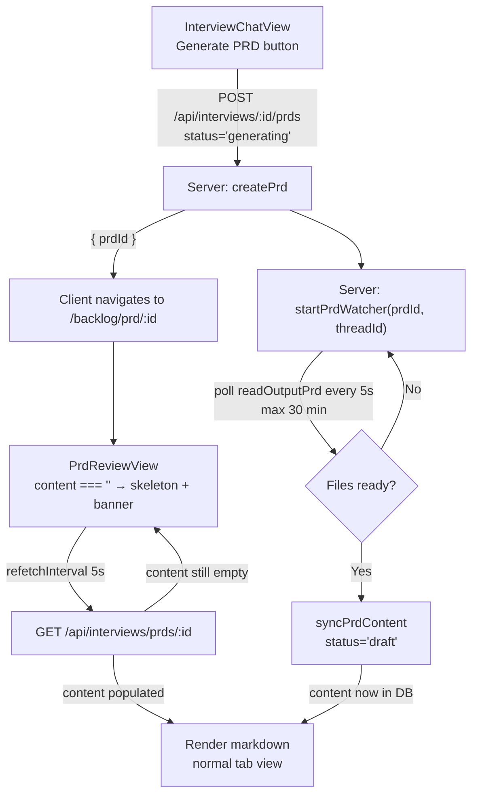
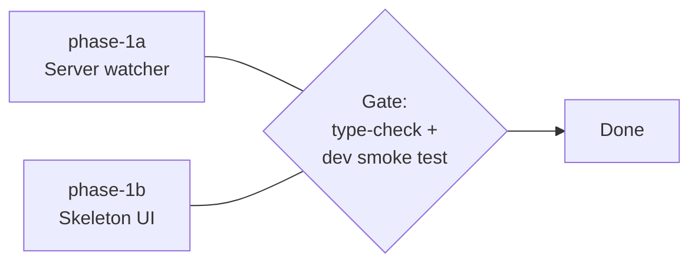

# PRD Generation UX — Background Watcher + Skeleton

## Current State

When a user clicks "Generate PRD" from a completed interview, `InterviewChatView` calls `handleGeneratePrd` which:

1. Starts a new chat thread (the `to-prd` skill).
2. Creates a PRD row with **empty content** and `status: 'draft'` via `POST /api/interviews/:id/prds`.
3. Navigates to `/backlog/prd/:prdId`.

`PrdReviewView` then detects `content === ''` + a valid `chatThreadId` and opens a live SSE connection via `useChatStream`. The agent writes a `.prd.md` output file; when the SSE `done` event fires with `prdReady: true`, the **client** calls `POST /api/interviews/prds/:id/sync` to read the file and write the markdown to the DB.

**Why this is insufficient:**
- If the user navigates away before the agent finishes, the sync never happens. The PRD stays empty forever.
- The generation UI is a raw agent-message stream — noisy, low-information, and gives no sense of the final PRD structure.
- The dashboard PRD card shows `draft` status with empty content, giving no signal that generation is in flight.

---

## Architecture



---

## Database Schema

No migration required. The `prds.status` column is `TEXT NOT NULL DEFAULT 'draft'` with no CHECK constraint — the new `'generating'` value can be inserted and queried without a schema change.

| Column | Type | Notes |
|---|---|---|
| `status` | `TEXT` | Values: `generating` (new) → `draft` → `approved` |
| `content` | `TEXT` | Empty string while generating; populated by watcher sync |

---

## Server Changes

### `src/server/services/prdService.ts`

- **`createPrd`**: change inserted `status` from `'draft'` to `'generating'`.
- **`startPrdWatcher(prdId, chatThreadId)`** (new export):
  - `setInterval` every 5 000 ms, max 360 attempts (30 min).
  - Each tick: calls `readOutputPrd(chatThreadId)` and `readOutputBacklog(chatThreadId)`.
  - On success: calls `syncPrdContent(prdId, content, backlog)` then clears the interval.
  - On timeout: clears the interval and logs a warning (PRD stays in `generating` state; user can retry via the manual `/sync` endpoint).
- **`syncPrdContent`**: accept an optional `finalStatus` parameter (default `'draft'`) and include it in the `UPDATE` statement alongside `content`.

### `src/server/routes/interviews.ts`

- In `POST /:interviewId/prds`: after `createPrd(...)` resolves, call `startPrdWatcher(result.prdId, chatThreadId)` — fire-and-forget (no `await`).
- No other route changes. The `POST /prds/:prdId/sync` endpoint stays as a manual fallback.

---

## Client Changes

### `src/shared/types/interview.ts`

- Add `'generating'` to the `PrdStatus` union type.
- Add `'generating'` case to `prdStatusLabel` helper → `'Generating'`.
- Add `'generating'` case to `prdBadgeClass` helper → maps to an accent/warning CSS class so the dashboard card shows a distinct "Generating…" badge.

### `src/client/hooks/useInterviews.ts`

In the `usePrd` hook, add:
```ts
refetchInterval: (query) =>
  query.state.data?.content === '' ? 5_000 : false,
```
This polls the PRD endpoint every 5 s while content is empty, stopping automatically once the watcher writes content to the DB.

### `src/client/components/PrdReviewView.tsx`

- Replace all `isGenerationMode` / `useChatStream` / `genPanel` logic with:
  ```ts
  const isGenerating = !!prd && prd.content === '';
  ```
- When `isGenerating === true`, render the skeleton layout (see below) instead of the tabs view.
- Remove: `useChatStream` import, `syncTriggered` state, `syncPrd` mutation auto-trigger, `genMessages`, `streamingText`, `prdReady`.
- The manual `/sync` endpoint may be kept as a "Retry" button shown only if the PRD is stuck in `generating` state beyond an expected threshold (optional, low-priority).

**Skeleton layout structure:**
```
[ skeleton title bar — wide shimmer block             ]
[ skeleton badge   ] [ skeleton badge ] [ skeleton btn ]
[ tab: Preview (active) | Edit (disabled) | Backlog (disabled) ]

┌─────────────────────────────────────────────────┐
│  ⟳  Generating your PRD… This may take a few   │
│     minutes. You can navigate away and return.  │
└─────────────────────────────────────────────────┘

[ H1 shimmer ████████████████████████████         ]
[    line 1  ████████████████████████████████████ ]
[    line 2  ████████████████████████████████     ]
[    line 3  ████████████████████████████████████ ]

[ H2 shimmer ████████████████                     ]
[    line 1  ████████████████████████████████████ ]
[    line 2  ████████████████████████████         ]

[ H2 shimmer ████████████████████████             ]
[    line 1  ████████████████████████████████████ ]
[    line 2  ████████████████████████████████████ ]
[    line 3  ████████████████████                 ]
```

### `src/client/components/PrdReviewView.module.css`

- Add `@keyframes shimmer` — horizontal gradient sweep (left-to-right, uses `--bg-secondary` / `--border-color` tokens, respects dark mode automatically).
- Add classes:
  - `.skeletonLine` — a rounded `div` with the shimmer animation; width set via inline style or modifier classes (e.g. `.w100`, `.w75`, `.w50`).
  - `.skeletonHeader` — taller `skeletonLine` variant for H1/H2 blocks.
  - `.generatingBanner` — accent-bordered rounded container at the top of the content area; flex row with a spin-animated SVG and two lines of text.
  - `.skeletonSection` — wrapper with bottom margin grouping a header + lines.

---

## Key Design Decisions

- **Skeleton + banner only — no live agent stream.** The raw agent-message stream was noisy, gave no structural context, and coupled the sync trigger to the user staying on the page. A clean shimmer skeleton previews the final PRD layout; a banner tells the user what is happening and that they can leave.
- **`status: 'generating'` added to `PrdStatus`.** This surfaces a "Generating…" badge on the InterviewsDashboard PRD card. No migration required — the column is unconstrained `TEXT`.
- **Server-side polling watcher over WebSocket/SSE.** `setInterval` in-process is the simplest reliable mechanism. No new infra, no persistent connection. 30-min max cap prevents runaway intervals.
- **Client polls via `refetchInterval`.** Leverages existing TanStack Query machinery; no new SSE channel needed for the "is it done?" question.
- **Remove `useChatStream` from generation path.** The server watcher handles persistence regardless of client navigation. Removing the SSE dependency simplifies `PrdReviewView` significantly.

---

## Phase Summary and Parallelization



**Phase 1 tasks are fully parallel** — server and client changes share no implementation dependency. Both must pass type-check before merging.

---

## Files Changed / Created

| Action | Path |
|---|---|
| Edit | `src/server/services/prdService.ts` |
| Edit | `src/server/routes/interviews.ts` |
| Edit | `src/shared/types/interview.ts` |
| Edit | `src/client/hooks/useInterviews.ts` |
| Edit | `src/client/components/PrdReviewView.tsx` |
| Edit | `src/client/components/PrdReviewView.module.css` |
