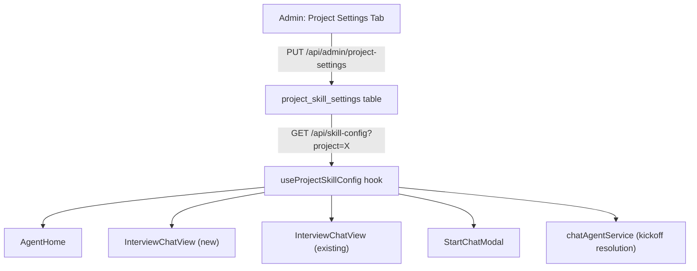
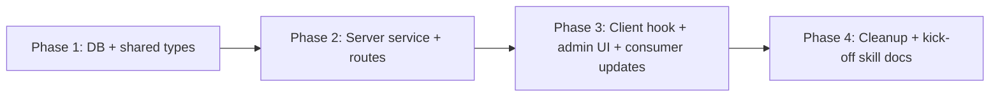

# Project Skill Settings

## Phase 0 — Classification

```
Type:  new-feature
Scope: medium (~10 files)
Layers: server, client, shared, db
```

Phase 3 (design doc) is mandatory.

---

## Current State

Today, skill repo + branch are resolved ad-hoc in every consumer:
- **AgentHome** — guesses repo by matching `selectedProject` name, uses ADO `defaultBranch`
- **InterviewChatView (new)** — lets user pick repo from a dropdown, uses `defaultBranch`
- **InterviewChatView (existing)** — hardcoded branch (`'tbi/enhance-to-prd'` for testing)
- **StartChatModal** — full project/repo/branch pickers (manual entry)
- **chatAgentService** — falls back to `'main'` when `kickoff.branch` is missing

This means: (a) users must know which repo/branch skills live on, (b) MaxView's non-`main` default gets lost, and (c) there's no central source of truth.

---

## Architecture



---

## Database Schema

New table `project_skill_settings`:

| Column | Type | Notes |
|--------|------|-------|
| id | uuid PK | default random |
| project | text UNIQUE NOT NULL | ADO project name (e.g. "MaxView") |
| skill_repo | text NOT NULL | Repo name where skills live |
| skill_branch | text NOT NULL | Branch to read from |
| updated_by | text | OID of last editor |
| created_at | timestamptz | default now |
| updated_at | timestamptz | default now |

---

## Server Changes

### New service: `src/server/services/projectSettingsService.ts`
- `getSkillConfig(project: string): Promise<ProjectSkillConfig | null>` — returns row or null (fallback handled by caller)
- `listSkillConfigs(): Promise<ProjectSkillConfig[]>` — all rows (admin view)
- `upsertSkillConfig(project, repo, branch, updatedBy): Promise<ProjectSkillConfig>` — insert or update on conflict(project)
- `deleteSkillConfig(project): Promise<void>`

### New routes on admin router: `src/server/routes/admin.ts`
- `GET /api/admin/project-settings` — list all configs (admin:roles)
- `PUT /api/admin/project-settings/:project` — upsert config (admin:roles)
- `DELETE /api/admin/project-settings/:project` — remove config (admin:roles)

### Public read endpoint: `src/server/routes/api.ts`
- `GET /api/skill-config?project=<name>` — returns `{ project, skillRepo, skillBranch }` or 404 (any authenticated user)

---

## Client Changes

### New hook: `src/client/hooks/useProjectSkillConfig.ts`
- `useProjectSkillConfig(project: string | null)` — fetches `/api/skill-config?project=X`, returns `{ skillRepo, skillBranch } | null`
- `useAllProjectSkillConfigs()` — admin-only, fetches `/api/admin/project-settings`
- `useUpsertProjectSkillConfig()` — mutation for admin
- `useDeleteProjectSkillConfig()` — mutation for admin

### New component: `src/client/components/AdminProjectSettings.tsx`
- Table: project | repo | branch | actions (edit/delete)
- Inline add/edit form: project selector (from `useSkillProjects`), repo selector (from `useSkillRepos`), branch input
- Gated by `admin:roles`

### Updated: `src/client/App.tsx`
- Admin area gets a tab bar: **Roles** | **Users** | **Project Settings**
- Route: `/admin/project-settings` renders `AdminProjectSettings`

### Updated consumers (all use `useProjectSkillConfig`):
- **AgentHome** — replace `useSkillRepos` + defaultRepo logic with `useProjectSkillConfig(selectedProject)`, pass `config.skillRepo` + `config.skillBranch` to `useSkillList`
- **InterviewChatView (NewInterviewCompose)** — remove repo dropdown; use config to resolve repo+branch; pass to kickoff
- **InterviewChatView (ExistingInterviewView)** — use config instead of hardcoded branch
- **StartChatModal** — remove project/repo/branch pickers; auto-resolve from config based on selected project (keep project selector + skill selector + model + transcript/context fields)

### Fallback behavior
When no admin config exists for a project: fall back to repo matching project name + ADO `defaultBranch` (preserves current behavior for unconfigured projects).

---

## Key Design Decisions

1. **Per-project, not global** — different ADO projects can have different skill repos (e.g. MaxView skills in one repo, Mobile skills in another).
2. **Admin is single source of truth** — removes cognitive load from users; they just pick a skill, not a repo/branch.
3. **Upsert semantics** — one row per project; admin can update without delete+recreate.
4. **Public read endpoint** — non-admin users need to resolve config to start chats; write endpoints stay admin-only.
5. **Fallback** — unconfigured projects gracefully degrade to current heuristic (repo name = project name, ADO default branch).

---

## Kick-off Skill Update

Recommend updating `/kick-off` (this repo, `.cursor/skills/kick-off/SKILL.md`) to add a note in Phase 2:
> "If the feature involves skill resolution, note that `useProjectSkillConfig` is the canonical source for repo + branch. Do not hardcode branch names or let users pick repos manually."

This is a documentation-only addition (no new skill needed).

---

## Phase Summary and Parallelization



- **Phase 1** (parallel): migration file + schema.ts update + shared types — no dependencies between them
- **Phase 2** (parallel): service + admin routes + public route — depends on Phase 1 types/schema
- **Phase 3** (parallel): hook, admin component, AgentHome update, InterviewChatView update, StartChatModal update — all depend on Phase 2 API being available
- **Phase 4**: Remove test branch override, update kick-off skill docs

---

## Files Changed / Created

| Action | Path |
|--------|------|
| Create | `migrations/<timestamp>_project-skill-settings.sql` |
| Edit | `src/server/db/schema.ts` |
| Create | `src/shared/types/projectSettings.ts` |
| Create | `src/server/services/projectSettingsService.ts` |
| Edit | `src/server/routes/admin.ts` |
| Edit | `src/server/routes/api.ts` |
| Create | `src/client/hooks/useProjectSkillConfig.ts` |
| Create | `src/client/components/AdminProjectSettings.tsx` |
| Create | `src/client/components/AdminProjectSettings.module.css` |
| Edit | `src/client/App.tsx` |
| Edit | `src/client/components/AgentHome.tsx` |
| Edit | `src/client/components/InterviewChatView.tsx` |
| Edit | `src/client/components/StartChatModal.tsx` |
| Edit | `.cursor/skills/kick-off/SKILL.md` |
